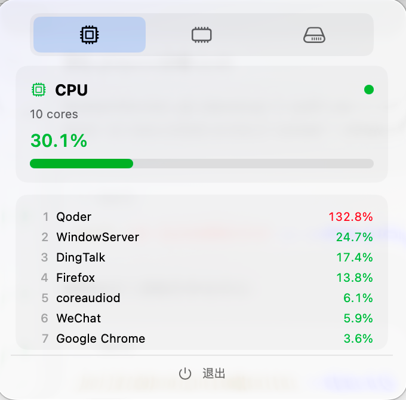
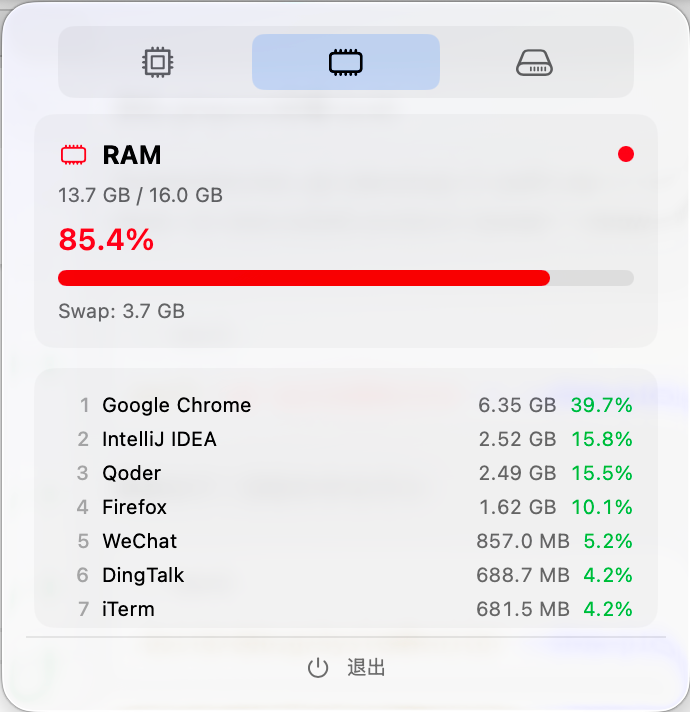
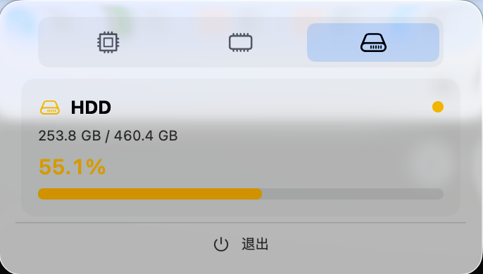

# SystemMonitor

一款轻量级 macOS 菜单栏系统监控应用，基于 SwiftUI 构建，实时展示 CPU、内存、硬盘使用情况及活跃进程信息。

## 功能特性

### CPU 监控
- 显示 CPU 核心数
- 实时总体使用率百分比
- 压力颜色指示：绿色（≤50%）/ 黄色（50%-80%）/ 红色（>80%）
- Top 10 CPU 占用进程排行

### 内存监控
- 已用内存 / 总内存容量显示
- 使用率百分比及胶囊进度条
- 压力颜色指示：绿色（≤50%）/ 黄色（50%-80%）/ 红色（>80%）
- Swap 使用量显示
- Top 10 内存占用进程排行（含具体内存用量，基于 `phys_footprint` 精确计算）

### 硬盘监控
- 磁盘总容量与已用空间（与系统"储存空间"面板完全对齐）
- 使用率百分比及胶囊进度条
- 自动识别 SSD / HDD 磁盘类型
- 压力颜色指示

### 进程管理
- 同名应用进程智能聚合（CPU 和内存累加统计）
- 自动从完整路径提取应用名称（支持 `.app` 包名识别）
- 针对短名称进程（如 `com`）的智能优化：通过 `proc_pidpath` 获取真实可执行路径，结合 `proc_name` 与路径解析避免无意义短名
- `com.apple.xxx` 格式系统进程自动提取服务名（如 `registerassistantservice`）
- 每 3 秒自动刷新数据

## 系统要求

| 项目 | 要求 |
|------|------|
| 操作系统 | macOS 14.0+ (Sonoma) |
| 架构 | Apple Silicon (arm64) |
| Swift | 5.9+ |

## 技术栈

- **语言**：Swift 5.9+
- **UI 框架**：SwiftUI
- **菜单栏集成**：MenuBarExtra（`.window` 样式）
- **构建工具**：Swift Package Manager
- **系统 API**：
  - `host_processor_info` — CPU 负载采集
  - `host_statistics64` — 内存统计
  - `proc_pid_rusage` — 进程精确内存占用（`phys_footprint`）
  - `proc_pidpath` / `proc_name` — 进程真实可执行路径与名称解析
  - `URLResourceKey.volumeAvailableCapacityForImportantUsageKey` — 磁盘空间（与 macOS "储存空间"面板对齐，自动排除可清除空间）
  - `diskutil` — 磁盘类型检测

### 数据单位约定

为与 macOS 系统面板保持一致，应用对不同类型数据采用对应的字节单位：

| 数据类型 | 单位 | 除数 | 对应系统面板 |
|---------|------|------|-------------|
| 内存（RAM、进程内存） | 二进制 GB（GiB） | 2³⁰ = 1,073,741,824 | 活动监视器 |
| 磁盘空间 | 十进制 GB | 10⁹ = 1,000,000,000 | 储存空间 |

## 编译与运行

```bash
# 克隆项目
cd SystemMonitor

# 编译
swift build

# 运行
swift run SystemMonitor

# 显示进程 PID（调试排查用）
swift run SystemMonitor --show-pid

# 或编译 Release 版本
swift build -c release

# Release 可执行文件路径
.build/release/SystemMonitor
```

> 应用启动后将以菜单栏图标（仪表盘图标）形式常驻，不会出现在 Dock 中。

### 启动参数

| 参数 | 说明 |
|------|------|
| `--show-pid` | 进程列表中显示 PID，便于排查不明进程（默认不显示） |

## 项目结构

```
SystemMonitor/
├── Package.swift                          # SPM 包配置
└── Sources/SystemMonitor/
    ├── App.swift                           # 应用入口，MenuBarExtra 配置
    ├── Info.plist                          # 应用信息配置
    ├── Monitors/                           # 数据采集层
    │   ├── CPUMonitor.swift               # CPU 信息采集
    │   ├── MemoryMonitor.swift            # 内存信息采集
    │   ├── DiskMonitor.swift              # 硬盘信息采集
    │   └── ProcessMonitor.swift           # 进程信息采集与聚合
    └── Views/                              # UI 展示层
        ├── MenuBarView.swift              # 主面板（Tab 切换 + 定时刷新）
        ├── CPUView.swift                  # CPU 信息卡片
        ├── MemoryView.swift               # 内存信息卡片
        ├── DiskView.swift                 # 硬盘信息卡片
        └── TopProcessView.swift           # 进程排行列表
```

## 架构设计

应用采用 **MVVM** 模式：

- **Model（Monitors）**：各 Monitor 类通过系统 API 采集数据，作为 `ObservableObject` 发布状态变化
- **View**：SwiftUI 视图订阅 Monitor 数据，自动响应更新
- **数据流**：`MenuBarView` 持有所有 Monitor 实例，通过 `Timer` 每 3 秒触发统一刷新

## 截图

<!-- 在此处添加应用截图 -->



<!--  -->

